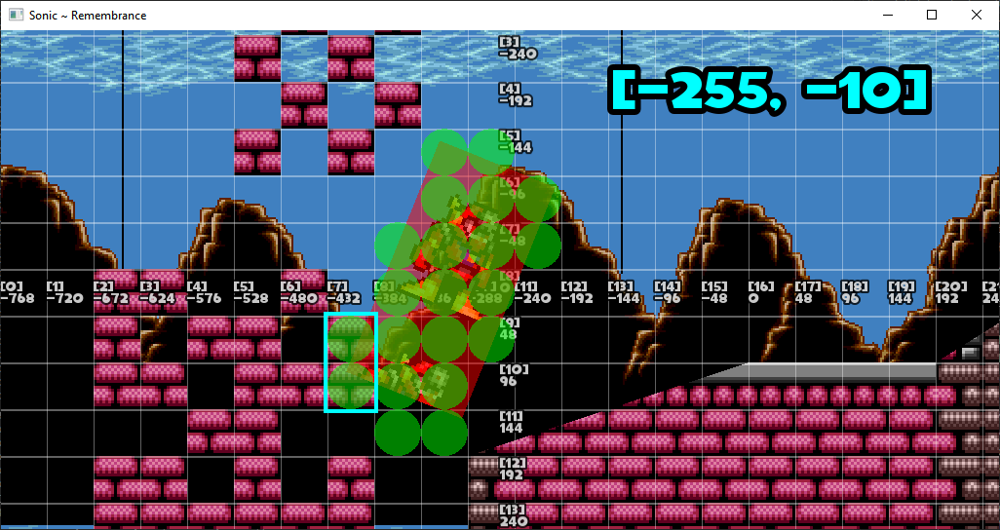

2d SFML platformer prototype W.I.P

Small preview showing parallax/tile rendering and OBB collision detection [here](resources/preview.mp4)

---

Credit/thanks

todo make sfml/tileson external links + cmake to lighten project
- Large thanks to [Open Net Battle](https://github.com/TheMaverickProgrammer/OpenNetBattle) for structure design inspiration/learning of C++
- https://www.learncpp.com/ for modern C++ learning
- aseprite, tiled, [tileson](https://github.com/SSBMTonberry/tileson) for sprite/map editing 
- Spriters Resource (list of rippers todo)
- the MM8BDM community because yes